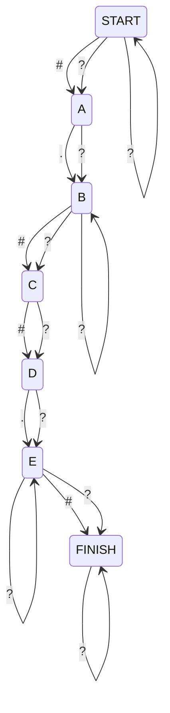

My plan is to use a automaton, specifically an NFA, to solve this problem. An NFA is a non-deterministic finite automaton. It's used in this case instead of a DFA (which would guarantee constant time) because we can, at the end, count how many entries are in the final state (empty) and on an accepting state. This will give us the number of valid paths.

This is an example I **printed** out to help me visualize the problem. I then created little paper pieces with the values `??.?#?.#.`, `?.?#?.#.`, `.?#?.#.`, and so on, which I then moved around the diagram to see how the automaton would behave and to help me visualize the problem. For the diagram, I used [mermaid](https://mermaid-js.github.io/mermaid/#/).

Must match the redundant record 1,2,1

Test: ??.?#?.#. should produce 4 valid paths

